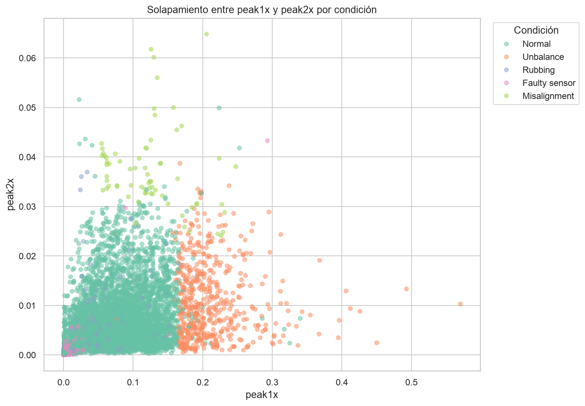

# Análisis exploratorio de fallas en bombas ESP/BEC

Proyecto de Análisis de Datos aplicado a Oil & Gas y diagnóstico de fallas. Explora características extraídas de señales de vibración de bombas eléctricas sumergibles para reconocer patrones, diferencias y relaciones entre condiciones normales y distintos tipos de falla.

> **Alcance:** calidad de datos, distribuciones, comparación visual entre condiciones y correlaciones. Esta etapa no incluye modelos predictivos.

- **[Ver el análisis en Python](analisis_exploratorio_fallas_esp.ipynb)**

El notebook incluye un índice navegable compatible con Google Colab para acceder directamente a cada sección y subsección.



## Índice

- [Pregunta y objetivo](#pregunta-y-objetivo)
- [Datos](#datos)
- [Tecnologías](#tecnologías)
- [Estructura](#estructura)
- [Conclusiones principales](#conclusiones-principales)
- [Limitaciones del análisis](#limitaciones-del-análisis)
- [Cómo reproducir el análisis](#cómo-reproducir-el-análisis)
- [Posibles aplicaciones y próximos pasos](#posibles-aplicaciones-y-próximos-pasos)

## Pregunta y objetivo

**Pregunta:** ¿qué patrones, diferencias y relaciones se observan en las características extraídas de señales de vibración correspondientes a condiciones normales y distintos tipos de falla en bombas ESP/BEC?

**Objetivo:** explorar las características extraídas de señales de vibración del dataset ESPset para evaluar la calidad de los datos, describir sus distribuciones, comparar el comportamiento de las variables entre condiciones de funcionamiento y analizar las relaciones existentes entre ellas.

## Datos

Se utiliza `features.csv` de **ESPset**, un conjunto público con 6.032 observaciones, 11 bombas y cinco condiciones de funcionamiento. Las señales fueron adquiridas durante ensayos de vibración realizados antes de la instalación definitiva de los equipos en pozos petroleros.

- [Repositorio oficial ESPset](https://github.com/NINFA-UFES/ESPset)
- [Mendeley Data — DOI 10.17632/m268jsw339.1](https://doi.org/10.17632/m268jsw339.1)
- Licencia del dataset: **CC BY 4.0**
- Artículo asociado: [DOI 10.1016/j.knosys.2024.111452](https://doi.org/10.1016/j.knosys.2024.111452)

La atribución completa se encuentra en [`ATTRIBUTION.md`](ATTRIBUTION.md).

## Tecnologías

- Python
- Pandas y NumPy
- Matplotlib y Seaborn
- Jupyter Notebook

## Estructura

```text
analisis-exploratorio-fallas-esp/
├── assets/
│   ├── distribucion_clases.png
│   └── solapamiento_peak1x_peak2x.png
├── analisis_exploratorio_fallas_esp.ipynb
├── data/
│   └── features.csv
├── .gitignore
├── ATTRIBUTION.md
├── README.md
└── requirements.txt
```

## Conclusiones principales

- No se detectaron valores faltantes ni registros completamente duplicados.
- La distribución de las condiciones es desigual: `Normal` concentra el 79,59 % de las observaciones y `Misalignment`, el 1,16 %. Esta composición es una característica relevante del dataset, pero no debe interpretarse como la frecuencia real de cada condición durante la operación en campo.
- La cobertura también es desigual entre equipos: `Normal` y `Unbalance` aparecen en las 11 bombas; `Faulty sensor` y `Rubbing`, en 7; y `Misalignment`, únicamente en las bombas 4 y 9.
- El 50 % central de `peak1x` para `Unbalance` se encuentra aproximadamente entre 0,179 y 0,222. Para `Misalignment`, el 50 % central de `peak2x` se ubica aproximadamente entre 0,033 y 0,040. Este comportamiento es consistente con firmas clásicas del análisis de vibraciones: el desbalanceo mecánico suele reflejarse en 1X, mientras que la desalineación puede presentar componentes en 1X y 2X.
- El scatterplot, los violin plots y el pairplot muestran diferencias entre algunas condiciones, pero también un solapamiento importante, especialmente entre `Normal`, `Rubbing` y `Faulty sensor`.
- Los valores extremos se conservaron porque podrían representar señales operativas relevantes, variaciones del equipo o posibles anomalías. Su causa requiere validación con especialistas.
- La relación positiva global más marcada se observa entre `median(8,13)` y `median(98,102)` (aproximadamente 0,755). Al segmentarla, es moderada en `Normal` (aproximadamente 0,395) y fuerte al reunir las fallas (aproximadamente 0,784).
- `a` y `b` presentan la relación negativa global más marcada (aproximadamente −0,58).

La distribución desigual de las condiciones no se considera un error que deba corregirse durante el EDA. Es un diagnóstico que deberá orientar una futura etapa de modelado: la evaluación tendría que realizarse por condición y separando las observaciones según la bomba de origen (`esp_id`), para evitar resultados dominados por la clase mayoritaria o por mediciones muy similares de un mismo equipo.

## Limitaciones del análisis

- Esta entrega es un análisis exploratorio sin modelado. Describe asociaciones y diferencias observadas, pero no demuestra causalidad ni capacidad predictiva.
- Las mediciones provienen de ensayos previos a la instalación; por lo tanto, la distribución de clases no representa directamente la frecuencia de las condiciones durante la operación de una bomba en campo.
- El dataset contiene solo 11 bombas y varias observaciones pertenecen a un mismo equipo, por lo que no necesariamente son independientes entre sí.
- Algunas condiciones están concentradas en pocos equipos. En particular, `Misalignment` aparece únicamente en las bombas 4 y 9; sus patrones también podrían reflejar características particulares de esas bombas.
- El análisis utiliza características previamente extraídas del espectro y no procesa directamente las señales crudas de vibración. Tampoco dispone de dirección de medición o información de fase para realizar un diagnóstico mecánico completo.
- No se dispone de información temporal, variables operativas ni historial de mantenimiento asociado con cada observación.
- El pairplot utiliza una muestra balanceada únicamente para facilitar la comparación visual; no representa la frecuencia real de las condiciones.
- El grupo `Fallas (todas)` reúne cuatro condiciones diferentes, por lo que su correlación no sustituye un análisis individual por tipo de falla.
- La interpretación física de `peak1x` y `peak2x` es una hipótesis coherente con principios de análisis de vibraciones, pero no fue validada por especialistas y no constituye por sí sola un diagnóstico de falla.

## Cómo reproducir el análisis

1. Descargar o clonar este repositorio.
2. Abrir una terminal en la carpeta del proyecto.
3. Instalar las dependencias:

   ```bash
   pip install -r requirements.txt
   ```

4. Abrir el notebook:

   ```bash
   jupyter lab analisis_exploratorio_fallas_esp.ipynb
   ```

5. Ejecutar las celdas en orden.

La celda de carga busca primero `data/features.csv`. Si el notebook se ejecuta en Colab y esa ruta no está disponible, monta Google Drive y utiliza la copia persistente guardada allí.

## Posibles aplicaciones y próximos pasos

- Comparar el comportamiento de las variables entre bombas para separar el efecto del equipo del efecto de la condición.
- Validar con especialistas en vibraciones y mantenimiento la interpretación de `peak1x`, `peak2x`, los valores extremos y las diferencias observadas.
- Ampliar la cantidad de equipos que presentan condiciones poco representadas, especialmente `Misalignment`.
- Incorporar información temporal, operativa o de mantenimiento si estuviera disponible.
- Crear un tablero interactivo para explorar variables, condiciones y equipos.
- Organizar los datos en una base SQL y practicar consultas e indicadores.
- Evaluar modelos más adelante utilizando una separación por `esp_id` y métricas que permitan revisar el desempeño de cada condición. En esa etapa también podría estudiarse, con mayor profundidad, si conviene aplicar remuestreo, clasificación multiclase o detección de anomalías.

## Autor

Kenny Ramirez — Ingeniero químico desarrollando competencias y proyectos en análisis y ciencia de datos, con foco en transformar datos en información útil para la toma de decisiones.
